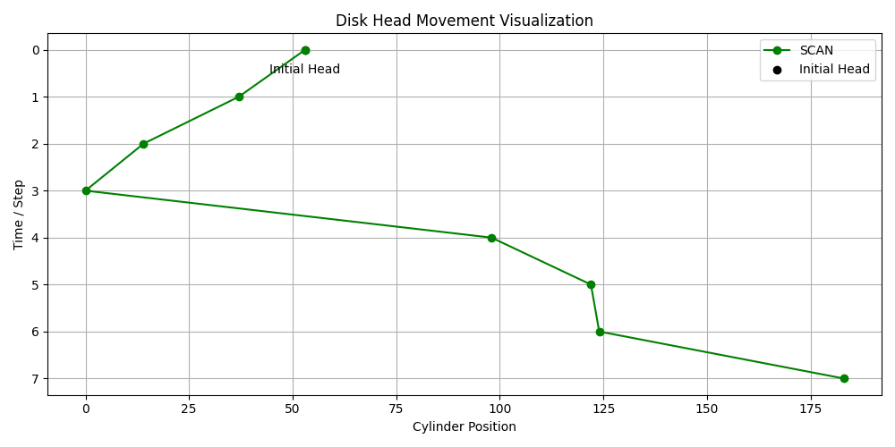

# Disk Scheduling Simulator

This is a command-line based disk scheduling simulator written in Python. It simulates how the disk head services cylinder requests using **FCFS**, **SCAN**, and **C-SCAN** algorithms. It also generates a visual graph to show head movement across cylinder positions.

## Features

- Supports the following disk scheduling algorithms:
  - **First-Come, First-Served (FCFS)**
  - **SCAN (Elevator Algorithm)**
  - **C-SCAN (Circular SCAN)**
- User-defined:
  - Number of cylinders
  - Queue of cylinder requests
  - Initial head position
  - Direction of head movement (for SCAN and C-SCAN)
- Displays:
  - Total seek time
  - Order of head movement
- Visual graph of the disk head path

## How It Works

The program accepts user input to simulate disk scheduling:
- `number of cylinders`: total number of available cylinders on the disk.
- `queue`: the cylinder numbers requested.
- `head`: the starting position of the disk head.
- `algorithm`: the strategy used to service the queue (FCFS, SCAN, or C-SCAN).
- `direction`: head direction at the start (inner or outer) for SCAN/C-SCAN

## Getting Started

### Requirements

- Python 3.x
- `matplotlib` library (for visualization)

Install the required package:

```bash
pip install matplotlib
```

### Running the Program

1. Clone the repository or copy the script.
2. Run the script:

```bash
python disk-schedulingAlgorithms.py
```

3. Follow the prompts to input:

- Total number of cylinders  
- Number of requests  
- Request values (space-separated integers)  
- Initial head position  
- Scheduling algorithm (FCFS / SCAN / C-SCAN)  
- Initial direction (outer / inner) for SCAN and C-SCAN

### Example

```text
Enter total number of cylinders (e.g., 5000): 200
Enter the number of requests in the queue: 6
Enter 6 cylinder requests separated by spaces: 98 183 37 122 14 124
Enter initial head position (0 to 199): 53
Enter algorithm to use (FCFS / SCAN / C-SCAN): SCAN
Enter initial direction (outer / inner): outer

--- Disk Scheduling Result ---
Algorithm Used: SCAN
Total Seek Time: 208
Order of Head Movement:
53 -> 98 -> 122 -> 124 -> 183 -> 199 -> 37 -> 14
```

## 📷 Example Output



## Algorithms

| Algorithm | Description |
|----------|-------------|
| FCFS | Services requests in the order they arrive |
| SCAN | Moves in one direction servicing requests, then reverses at the end |
| C-SCAN | Moves in one direction servicing requests, jumps to the beginning, and continues |

## Visualization

The program uses `matplotlib` to show:
- X-axis: Cylinder position
- Y-axis: Step/time (inverted to represent movement over time)
- Initial head position
- Direction and path of movement

## License

This project is open-source and free to use for educational or personal purposes.